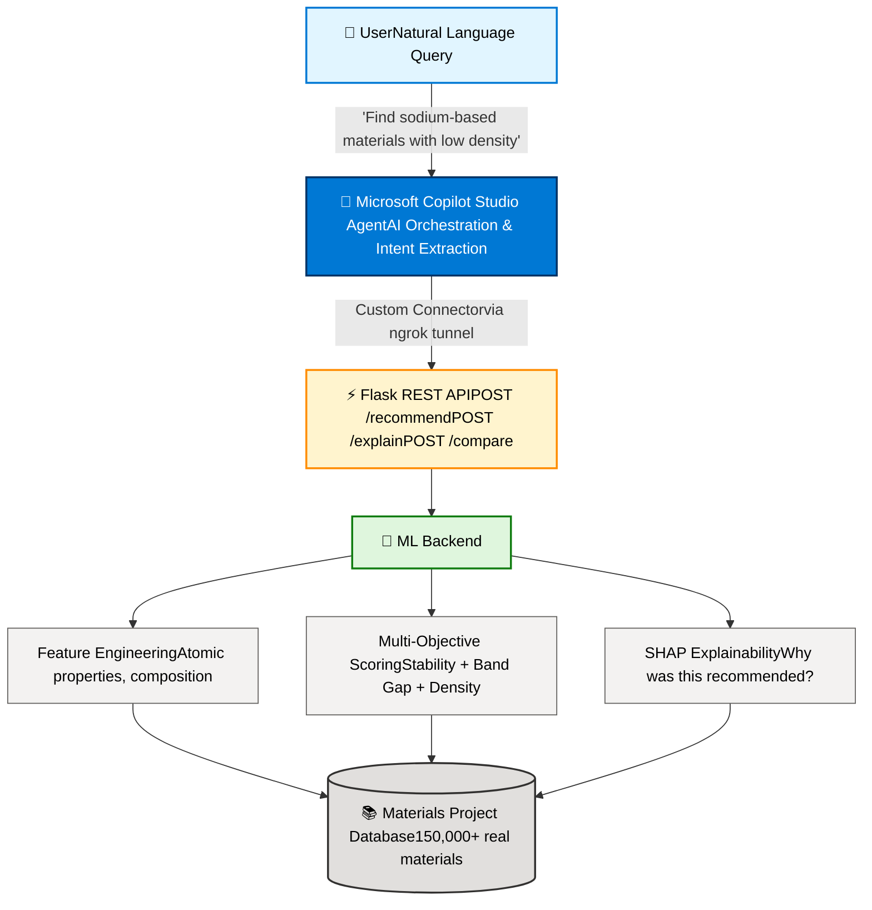

🔬 Materials Discovery Copilot Agent

> An end-to-end AI-powered materials discovery system built on Microsoft Copilot Studio, inspired by the Microsoft x Pacific Northwest National Laboratory (PNNL) research that used AI to reduce lithium usage in batteries by 70%.

---

## 📌 Overview

This project builds a production-grade **Microsoft Copilot Studio agent** that enables researchers, engineers, and students to query sustainable material alternatives using natural language. The agent is powered by a Python ML backend, real scientific data from the Materials Project database (150,000+ materials), and SHAP-based explainable AI.

### Example queries the agent handles:

- “Show me the top 3 most stable lithium-based materials”
- “Which iron-based materials have the highest stability?”
- “Find sodium-based materials with low density”
- “Show materials with band gap between 1 and 3 eV”
- “Which carbon-based materials are stable and not too dense?”
- “Rank silicon-based materials based on overall score”
- “Compare the top 3 sodium-based materials based on stability and density”
- “Why is the top-ranked lithium material ranked first?”

---

## 🎬 Demo


---

## 🏗️ Architecture

---

## 🛠️ Technology Stack

| Layer | Technology |
|-------|-----------|
| **Data Source** | Materials Project API (`mp-api`) |
| **Data Pipeline** | Python 3.11, Pandas, DuckDB |
| **Feature Engineering** | Mendeleev (periodic table), NumPy |
| **ML Model** | Scikit-learn (Gradient Boosting surrogate model) |
| **Explainability** | SHAP (TreeExplainer, waterfall plots) |
| **API** | Flask, Flask-CORS |
| **Public Tunneling** | ngrok |
| **Agent Platform** | Microsoft Copilot Studio |
| **Connector** | Microsoft Power Platform Custom Connector |
| **Evaluation** | Precision@K, Spearman correlation, Scipy |

---

## 📊 Project Pipeline

### 1. Data Ingestion
Fetches 500+ diverse materials from the Materials Project API across 18 target elements (Li, Na, Mg, Fe, Cu, O, Si, etc.) — all filtered for thermodynamic stability (`energy_above_hull ≤ 0.1 eV`).

### 2. Feature Engineering
Converts raw chemical formulas into domain-aware ML features using periodic table properties:
- Element fractions and composition analysis
- Average atomic number, electronegativity, atomic radius, atomic mass
- Compositional complexity (number of distinct elements)

### 3. Multi-Objective Scoring
A weighted scoring function combining three objectives:
Score = 0.5 × stability + 0.3 × band_gap + 0.2 × density

Materials are classified via a RAG system:
- 🟢 **Green** — Strong candidate (score > 0.7)
- 🟡 **Amber** — Moderate candidate (0.4–0.7)
- 🔴 **Red** — Weak candidate (< 0.4)

### 4. SHAP Explainability
A gradient boosting surrogate model learns the weighted scoring function, enabling SHAP-based explanations for every recommendation. Generates:
- Numerical feature contributions
- Natural language explanations
- Waterfall plots per material

### 5. Evaluation Metrics
- **Precision@3**, **Precision@5**, **Precision@10**
- **Spearman rank correlation** with domain-expert heuristic
- **Usability coverage** (proportion classified Green/Amber)
- Per-element performance breakdown

### 6. REST API (Flask)
Three endpoints consumed by the Copilot agent:
- `POST /recommend` — returns top-N materials, optionally filtered by element
- `POST /explain` — returns SHAP-based natural language explanation
- `POST /compare` — compares two materials side by side

### 7. Copilot Studio Agent
A Microsoft Copilot Studio agent orchestrates natural language conversations, dynamically extracts parameters (element, count) using AI, and calls the Flask API via a Power Platform custom connector tunneled through ngrok.

---

## 📁 Project Structure
materials-discovery-copilot/
├── api/
│   └── app.py                    # Flask REST API
├── data/
│   ├── materials_data.csv        # Raw materials fetched from API
│   ├── materials_features.csv    # Engineered features
│   ├── materials_scored.csv      # Final scored and ranked
│   ├── material_explanations.csv # SHAP-based explanations
│   ├── evaluation_report.csv     # Model evaluation metrics
│   ├── materials.db              # DuckDB database
│   └── shap_*.png                # SHAP waterfall plots
├── pipeline/
│   ├── fetch_materials.py        # Data ingestion
│   ├── feature_engineering.py    # Domain-aware feature engineering
│   ├── scoring_model.py          # Multi-objective scoring
│   ├── evaluation.py             # Evaluation metrics
│   ├── shap_explainer.py         # SHAP explainability
│   └── inspect_data.py           # Debug utility
├── copilot/
│   └── agent_config.json         # Copilot Studio agent exports
├── docs/
│   ├── screenshots/              # Agent screenshots
│   └── Project_Charter.docx      # Formal project charter
├── .gitignore
├── README.md
└── requirements.txt

---

## 🚀 Quick Start

### Prerequisites
- Python 3.11
- A free Materials Project API key (https://materialsproject.org)
- ngrok account (https://ngrok.com)
- Microsoft 365 account with Copilot Studio access

### 1. Clone and set up environment
```bash
git clone https://github.com/MrKhaled007/materials-discovery-copilot.git
cd materials-discovery-copilot
py -3.11 -m venv venv
venv\Scripts\activate
pip install -r requirements.txt
```

### 2. Set your Materials Project API key
```powershell
$env:MP_API_KEY = "your_api_key_here"
```

### 3. Run the full data pipeline
```bash
python pipeline/fetch_materials.py
python pipeline/feature_engineering.py
python pipeline/scoring_model.py
python pipeline/evaluation.py
python pipeline/shap_explainer.py
```

### 4. Start the Flask API
```bash
python api/app.py
```

### 5. Expose it via ngrok
```bash
ngrok http 5000
```

### 6. Configure Copilot Studio
Create a custom connector pointing to your ngrok URL and configure the `recommend`, `explain`, and `compare` operations.

---

## 📈 Evaluation Results

The model was evaluated against a domain-expert heuristic on 500+ materials across 18 target elements.

| Metric | Value |
|--------|-------|
| Precision@3 | ~66% |
| Precision@5 | ~60% |
| Precision@10 | ~50% |
| Spearman correlation | ~0.54 (Moderate agreement) |
| Usability coverage (Green/Amber) | ~78% |

---

## 🔬 Inspiration

This project was directly inspired by the **Microsoft x Pacific Northwest National Laboratory (PNNL)** collaboration, which used AI to discover a new battery material that reduces lithium consumption by up to **70%**. As Krysta Svore from Microsoft Research stated:

> "We need to really compress the next 250 years of chemistry material science into the next two decades."

This project builds an accessible, student-scale version of that vision using Microsoft Copilot Studio, demonstrating that conversational AI and explainable ML can democratise materials science research.

---

## 👤 Author

**Mohammed Khaled**
Bachelor in Data Science, Protection & Security
Thomas More University of Applied Sciences — Mechelen, Belgium

- 🔗 [LinkedIn](https://linkedin.com/in/mohammed-khaled-43a220183)
- 💻 [GitHub](https://github.com/MrKhaled007)

---

## 🙏 Acknowledgments

- **Microsoft Belux** and **Michelle Noom** — for the inspiring Student Talent Career Event (April 2026) that sparked this project
- **Microsoft x PNNL** — for the foundational research on AI-driven materials discovery
- **Materials Project** — for providing open access to the world's largest materials database

---

## 📜 License

MIT License — see `LICENSE` file for details.
